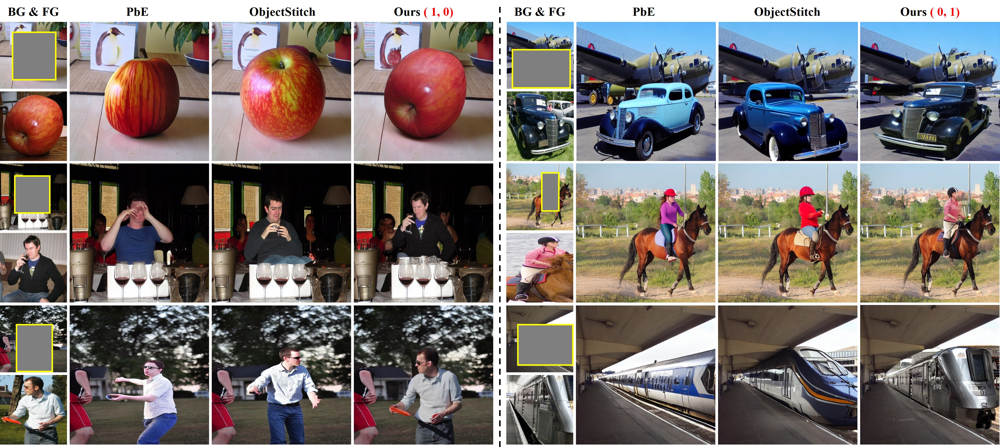
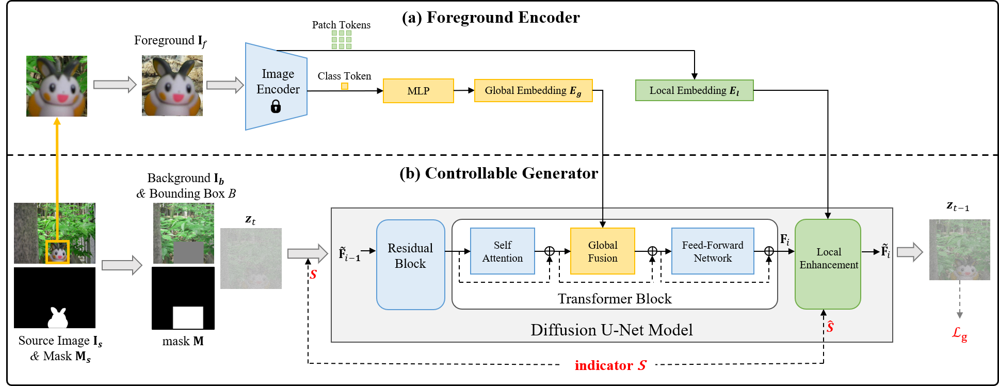

# ControlCom-Image-Composition

This is the official repository for the following research paper:

> **ControlCom: Controllable Image Composition using Diffusion Model**  [[arXiv]](https://arxiv.org/pdf/2308.10040.pdf) 
>
> Bo Zhang, Yuxuan Duan, Jun Lan, Yan Hong, Huijia Zhu, Weiqiang Wang, Li Niu 
>

## Task

In our controllable image composition model, we unify four tasks in one model using an 2-dim binary indicator vector, in which the first (*resp.*, second) dimension represents whether adjusting the foreground illumination (*resp.*, pose) to be compatible with background.  1 means making adjustment and 0 means remaining the same. Therefore, (0,0) corresponds to image blending, (1,0) corresponds to image harmonization, (0,1) corresponds to view synthesis, (1,1) corresponds to generative composition. 

  
  

Our method can selectively adjust partial foreground attributes. Previous methods may adjust the foreground color/pose unexpectedly and even unreasonably, even when the foreground illumination and pose are already compatible with the background. In the left part, the foreground pose is already compatible with background and previous methods make unnecessary adjustment. In the right part, the foreground illumination is already compatible with the background and previous methods adjust the foreground color in an undesirable manner. 

  
  

## Network Architecture

Our method is built upon stable diffusion and the network architecture is shown as follows.

  
  

## Code and Model

Coming soon!

## Experiments

We show our results using four types of indicators. 

  
  

## Other Resources

+ We summarize the papers and codes of image composition from all aspects: [Awesome-Image-Composition](https://github.com/bcmi/Awesome-Image-Composition)
+ We summarize all possible evaluation metrics to evaluate the quality of composite images:  [Composite-Image-Evaluation](https://github.com/bcmi/Composite-Image-Evaluation)
+ We write a comprehensive on image composition: [the 3rd edition](https://arxiv.org/abs/2106.14490)
